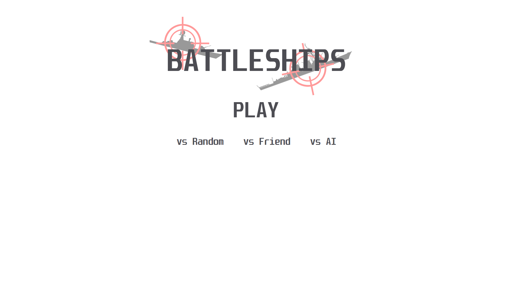
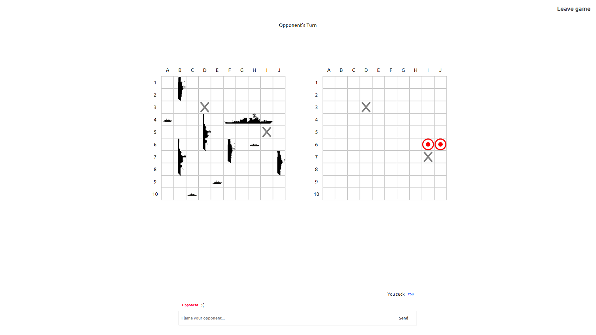

# About

Battleships game with three player modes:

 - vs AI
 - vs Random player
 - vs Invited player

# Setup

Clone the repository

```
$ git clone https://github.com/Koki131/Battleships.git
```

Run the backend.

Run the frontend

```
$ npm start
```

Enjoy the game!

# Preview




